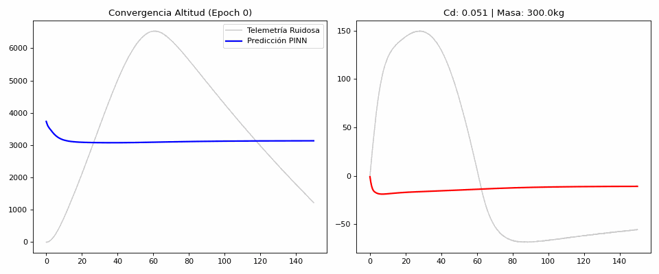
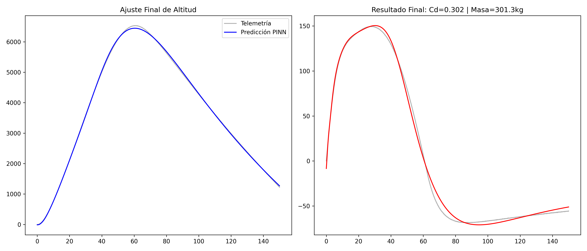

# Inverse Drag Discovery 🚀
### Physics-Informed Machine Learning for Aerospace Parameter Identification


---

## 📌 Visión del Proyecto

**Inverse Drag Discovery** es un marco de trabajo de **Scientific Machine Learning (SciML)** diseñado para el descubrimiento automatizado de parámetros físicos en sistemas dinámicos no lineales. El proyecto utiliza **Physics-Informed Neural Networks (PINNs)** para identificar el coeficiente de arrastre ($C_d$) y la masa ($m$) de un vehículo suborbital a partir de telemetría ruidosa, integrando las leyes de la cinemática directamente en el grafo de computación de la red neuronal.

---

## 🔬 El Problema Inverso

En la ingeniería aeroespacial, la identificación de parámetros es un **problema inverso** clásico: dada una trayectoria observada $\mathbf{s}_{obs}(t)$, ¿cuáles son las constantes físicas que mejor explican ese movimiento? 

Este desafío se ve agravado por el **ruido instrumental** (IMUs y GPS comerciales) y la **densidad atmosférica variable**, lo que hace que los métodos de regresión tradicionales fallen. Nuestra PINN resuelve esto optimizando simultáneamente los pesos de la red y los parámetros físicos, utilizando las Ecuaciones Diferenciales Ordinarias (EDOs) como un regularizador soberano.

---

## 🧠 Fundamentación Matemática

### Dinámica del Vehículo (EDOs)
El sistema resuelve el siguiente conjunto de EDOs acopladas que describen la balística con empuje y arrastre:

$$
\frac{d}{dt} \begin{bmatrix} x \\ y \\ v_x \\ v_y \end{bmatrix} = 
\begin{bmatrix} 
v_x \\ 
v_y \\ 
\frac{T \cos(\theta) - F_{d,x}}{m} \\ 
\frac{T \sin(\theta) - F_{d,y}}{m} - g 
\end{bmatrix}
$$

Donde la fuerza de arrastre aerodinámico $F_d$ sigue el modelo de densidad exponencial:
$$F_d = \frac{1}{2} \rho_0 e^{-y/H} \|\mathbf{v}\|^2 C_d A$$

### Physics-Informed Loss
La red se entrena minimizando un funcional de pérdida compuesto:
$$\mathcal{L} = \mathcal{L}_{data} + \lambda \mathcal{L}_{physics}$$

Donde $\mathcal{L}_{physics}$ representa el residuo de las EDOs calculado mediante **Diferenciación Automática (Autograd)**:
$$\mathcal{L}_{physics} = \frac{1}{N} \sum_{i=1}^N \left\| \frac{d\hat{\mathbf{s}}}{dt} - f(t, \hat{\mathbf{s}}, C_d, m) \right\|^2$$

---

## 📊 Resultados y Visualización

### Convergencia de Parámetros
La animación muestra cómo la PINN ajusta la trayectoria mientras descubre los valores reales de $C_d$ y Masa. A medida que las épocas avanzan, la predicción "ancla" la física a los datos ruidosos.

<p align="center">
  
</p>

### Comparativa Final
Tras el entrenamiento, se observa un ajuste de alta fidelidad tanto en altitud como en velocidad, filtrando el ruido instrumental de manera efectiva.

<p align="center">
  
</p>

---

## 🤖 Auditoría de IA (Gemini CLI)

El sistema incluye una fase de auditoría automatizada. Según el reporte generado en `docs/reporte_cd.txt`:
*   **Identificación de Drag:** La IA confirmó una deceleración no lineal tras los 85s (fase de descenso), indicando una "huella digital" clara de la resistencia atmosférica.
*   **Veredicto Técnico:** Los datos presentan suficiente varianza para que la PINN logre "aislar" el coeficiente de arrastre del término gravitatorio, validando el enfoque SciML.

---

## 🛠️ Guía de Ejecución

### Configuración del Entorno
```bash
# Crear y activar venv
python3 -m venv venv
source venv/bin/activate

# Instalar dependencias
pip install -r requirements.txt
```

### Pipeline de Operaciones
Para ejecutar la simulación completa, el entrenamiento de la PINN y la auditoría de IA:
```bash
chmod +x cli/generar_reporte.sh
./cli/generar_reporte.sh
```

---
**Jefferson Conza**  
*Mathematics Student | ML Engineer*
